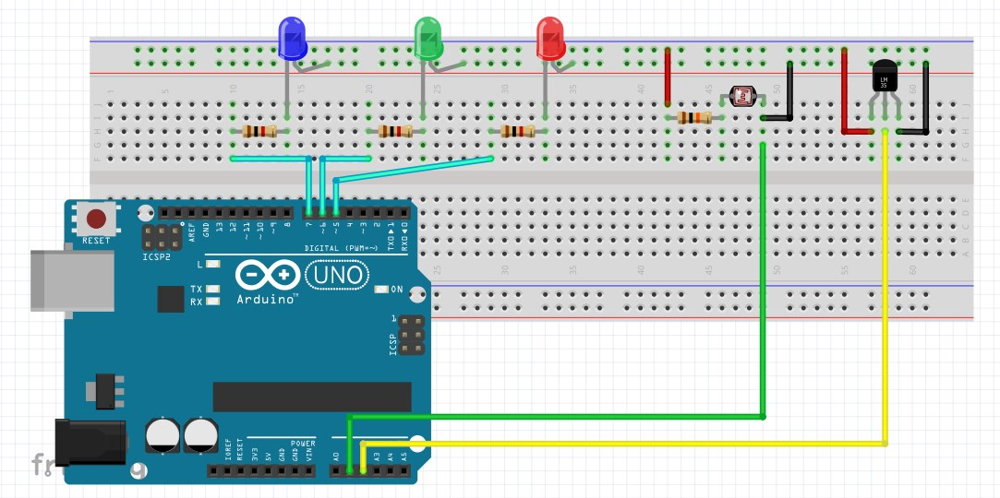

# EngAmostra

EngAmostra by Felipe Garcia - graduando em Eng. da Computação/4º Semestre
Setembro/2018

Programa criado com o intuito de apresentar o curso de Engenharia de Computação
nas feiras e eventos, sendo de simples montagem e com interatividade com o usuário
disponível via serial (USB).

## Componentes:
- 1x Led Azul
- 1x Led Verde
- 1x Led Vermelho
- 3x Resistores (1K)
- 1x Resistor (10K)
- 1x LDR
- 1x LM35 sensor de temperatura
- Jumpers

## Considerações
- Ao abrir o programa, a conexão só é feita quando o botão de reload no canto superior 
esquerdo for clicado.

- O programa está pronto para ser usado, bastando conectar o cabo do arduino ao computador 
antes de clicar no botão de reload (se for tentado conectar sem o arduino, o programa  
travará e fechará).

- Caso não se possua os componentes LDR e LM35, é necessário ligar o switch verde 
ao lado dos textos de luminosidade e temperatura, assim cancelando a leitura deles pelo
programa (sem esses componentes, o programa travará depois de um tempo).

- Não é necessário ter os leds (isto é, o programa não travará sem eles). O botão azul 
ativa também o led smd do arduino, referenciado como LED_BUILTIN.

- OBS.: É necessário ter o driver do Arduino instalado na máquina. A instalação é simples, 
geralmente automática via Windows Update, mas, caso a instalação falhe, é necessário 
ter direitos de Administrador para instala-los manualmente.

- Programa escrito em Python a partir do framework Kivy.

## Esquema

